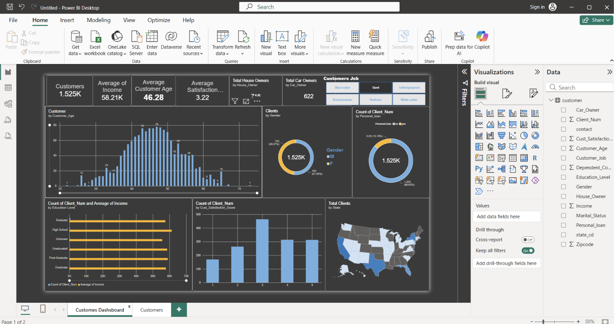

# CUSTOMER-DEMOGRAPHICS-FINANCIAL-ANALYTICS

# 📊 Customer Demographics & Financial Analytics Dashboard

## 📌 Project Overview

This project is an interactive **Customer Demographics & Financial Analytics Dashboard** developed using **Microsoft Power BI**.

The project focuses on data cleaning, transformation, analysis, and visualization to understand customer demographics, financial information, employment, education, personal loans, ownership patterns, and customer satisfaction.

---

## 🎯 Project Objectives

- Clean and transform raw customer data using Power Query.
- Analyze customer demographics and behavior.
- Analyze customer income and age distribution.
- Understand education and job profiles.
- Analyze personal loan distribution.
- Compare house and car ownership.
- Analyze customer satisfaction scores.
- Identify customer distribution across different states.

---

## 📊 Key Performance Indicators

The dashboard includes the following KPIs:

- 👥 Total Customers
- 💰 Average Income
- 🎂 Average Customer Age
- ⭐ Average Customer Satisfaction Score
- 🏠 Total House Owners
- 🚗 Total Car Owners

---

## 📈 Dashboard Analysis

### Customer Demographics

- Customers by Gender
- Customers by Age
- Customers by Education Level
- Customers by Marital Status
- Customers by State

### Financial Analysis

- Average Income Analysis
- Personal Loan Distribution
- House Ownership Analysis
- Car Ownership Analysis

### Employment Analysis

- Customers by Job Category
- Average Age by Customer Job
- Education Level by Customer Job

### Customer Satisfaction Analysis

- Customer Satisfaction Score Distribution
- Customer Job and Satisfaction Analysis
- Education Level and Satisfaction Analysis

---

## 🧹 Data Cleaning

Data cleaning and transformation were performed using **Power Query**.

The following steps were performed:

- Checked for missing values.
- Checked and removed duplicate records.
- Corrected data types.
- Renamed columns where required.
- Removed unnecessary data.
- Prepared the dataset for analysis and visualization.

---

## 🛠️ Tools & Technologies Used

- Microsoft Power BI
- Power Query
- DAX
- Data Cleaning
- Data Transformation
- Data Analysis
- Data Visualization

---

## 📂 Dataset Features

The dataset contains customer-related information including:

- Client Number
- Customer Age
- Gender
- Income
- Education Level
- Customer Job
- Marital Status
- Personal Loan
- House Owner
- Car Owner
- Customer Satisfaction Score
- State

---

## 📄 Dashboard Pages

### Page 1: Customer Overview

This page provides an overall analysis of customers, including:

- Key Performance Indicators
- Customer Age Distribution
- Gender Distribution
- Education Level Analysis
- Customer Satisfaction Score
- Personal Loan Distribution
- State-wise Customer Distribution
- House and Car Ownership

### Page 2: Detailed Customer Analysis

This page provides deeper customer insights, including:

- Customers by Marital Status
- Customers by Job
- Average Age by Customer Job
- Education Level by State
- Customer Job and Satisfaction Analysis
- Education Level by Customer Job

---

## 💡 Key Insights

The dashboard helps answer important business questions such as:

- What is the average income of customers?
- What is the average age of customers?
- What is the gender distribution of customers?
- Which education levels have the highest number of customers?
- Which job categories have the most customers?
- How many customers have personal loans?
- How many customers own houses and cars?
- Which states have the highest number of customers?
- What is the overall customer satisfaction score?

---

## 📸 Dashboard Preview

### Customer Overview



### Detailed Customer Analysis


---

## 📁 Project Structure

```text
CUSTOMER-DEMOGRAPHICS-FINANCIAL-ANALYTICS/
│
├── customer_Dashboard.pbit
├── customer.csv
├── dashboard-page-1.pdf
├── README.md
│
└── images/
    ├── dashboard-page-1.png
    └── dashboard-page-2.png


## 👨‍💻 Author

**Akash Singh**

B.Tech Student | Aspiring Data Analyst

### 📫 Connect With Me

- GitHub: Add your GitHub profile link
- LinkedIn: Add your LinkedIn profile link

---

⭐ If you found this project useful, feel free to star the repository!
